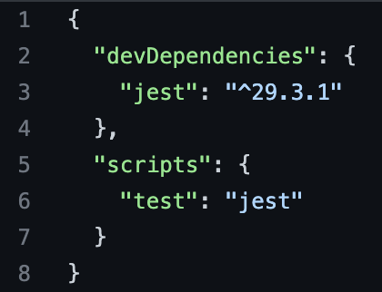

**EN**
# 
# Technical Test - Weather WebApp

## A functional project of a weather web app to search a city to get to know the actual weather and 5 days forecast

This project was built using HTML for structure, CSS for styling, JavaScript for functionalities and an API from OpenWeather to work with external data.

Here I go over each of the steps and technologies I used:

1. **HTML**
Created "index.html" file in project`s root and implemented basic html structure with semantic html tags to reinforce the meaning of the content and to improve SEO 

2. **Images Folder**
Created **img** folder for the favicon icon and inside a separate folder with the weather icons

3. **CSS**
Created styles folder and inside it I created the specific **style.css** file with a universal selector with pseudo element specifications for the webapp window border-box specs, declared global variables to use within the css file and all the corresponding styles of my project, using type selectors, class selectors and id selectors

4. **Fetching Weather data using OpenWeather APIs**
First I created the file **api_key.js**, and after creating my account through [OpenWeather](https://openweathermap.org/) I copied my personal keys to make calls to the API to variables inside **api_key.js** to use them later 

5. **JavaScript**
I created an **app.js** file and structured it in the following way:

- At the top of the file you will find all the **global variables** I needed to store the data I required (arrays, strings, JS Methods, JS object, Math.round function)
- function **checkDay()** to check the day 
- function **dayAppears()** to render the day through id selector when checkDay() is successfull
- arrow function **getDataForecast(apiUrl)** implementing fetch with openWeather API and nested methods inside
- arrow function **getWeather()** to get actual weather, implementing JS method to inject HTML after successfull fetch and a condition to cast getDataForecast fetch once getWeather()'s fetch has been successfull
- Implemented an **addEventListener** to launch fetches and nested methods once the search button is clicked

## How to run the app:

In order to run the app you will need to have [git](https://git-scm.com/downloads) previously installed in your system/computer, choose a code editor of your choice and follow these steps:

* Copy URL of the [github project](https://github.com/SRomK/Weather_WebApp_JS)
* Open VSCode or editor of your choice, select or create an empty folder to inject the project when cloned 
* Open Terminal in VSCode
* Run command **git clone** (repository url)
* Install Live Server extension in VSCode to compile web app with the web browser of your choice (preferably [Chrome](https://support.google.com/chrome/answer/95346?hl=es&co=GENIE.Platform%3DDesktop))

## To run jest test 

You will need clone the repo into an empty folder in your system, and with VSCode already opened with the respective project folders and files already injected in the empty folder, open a terminal and install jest with the command:
### `npm i jest -D`

And to run the test use the command:

### `npm test utils.test.js`

**Note:** in case package.json file doesn't clone properly, the json file should include de script for testing, like this:

## Fast Visualization

Just download from this [Google Drive Link](https://drive.google.com/drive/folders/1yTgq_FLXpR8ZTg6IUkz-ZG9FCsWw7xfM?usp=share_link) all the  project files to your computer and launch the **index.html** file to open with your web browser (preferably [Chrome](https://support.google.com/chrome/answer/95346?hl=es&co=GENIE.Platform%3DDesktop)). From green botton named `<CODE>`in the github repository, you can download the zip file.

***********************************************************

**ES**
# 
# Prueba Técnica - Weather WebApp

##